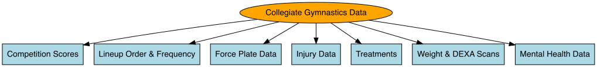

# End of the Year Collegiate Gymnastics Report

**Project Description:**  
This end-of-year report focused on analyzing individual and team performance for a Division I collegiate gymnastics team throughout a season. The objective was to uncover actionable insights on what contributed to performance successes and shortcomings, with the goal of informing strategic decisions to improve future outcomes.

**[➡️ Sample PDF Report Here](images/Gymnastics/gym_pp.pdf)**

---

## 1. Data Description

The dataset for this report includes multiple sources covering physical performance, health metrics, and competition outcomes:

- **Competition Scores**  
  Individual and team scores were analyzed overall and per apparatus (vault, bars, beam, floor). Summary statistics (min, max, range, mean, median, and standard deviation) were computed. Averages were calculated both including and excluding routines with falls to assess their impact on scoring.

- **Lineup Order and Frequency**  
  The order and frequency of athlete appearances in competition lineups were evaluated per apparatus. We investigated whether lineup position influenced score outcomes and whether consistency in placement yielded performance benefits.

- **Force Plate Data**  
  Collected from countermovement and drop jumps in preseason and throughout the competition season. Key metrics included contact time, flight time, reactive strength index (RSI), stiffness, concentric mean power, and peak power. These metrics were analyzed longitudinally to assess fitness progression, recovery status, and their relationship to competition performance—especially on vault and floor.

- **Injury Data**  
  Detailed records of injuries were analyzed by type (e.g., sprains, strains), location (e.g., ankle, knee), mechanism (e.g., hyperextension, compression), apparatus, recovery timeline, and missed competitions. Injury occurrences were contextualized with training phases and previous season history to identify risk factors and patterns.

- **Treatments**  
  The frequency of recovery treatments was assessed across the season, including breakdowns by month, training phase, and proximity to competitions. Peaks in treatment volume were flagged for further investigation and compared with the previous season.

- **Weight and DEXA Scans**  
  Significant fluctuations in weight (above set thresholds) were identified. Changes in fat mass and fat-free mass were tracked over time to understand physiological changes and their potential correlation with performance or injury risk.

- **Mental Health Data**  
  Mental health appointment frequencies were analyzed monthly and by competition week. Patterns were explored both at the team level and by athlete class (freshmen through seniors) to detect periods of increased mental health service usage.

*Figure 1: Diagram summarizing the main data sources used in the gymnastics performance report.*

---

## 2. Project Process

### 2.1 Data Preprocessing

- Imported and merged multiple datasets, standardized date formats, and cleaned inconsistent labels.
- Created unique athlete identifiers and joined datasets across performance, treatment, and health metrics.
- Computed derived metrics (e.g., fall-adjusted averages, RSI) and flagged anomalous values or implausible entries.
- Defined training phases (preseason, early season, peak season, postseason) to contextualize trends.

### 2.2 Exploratory Data Analysis (EDA)

- Plotted longitudinal trends of team and individual scores, highlighting inflection points and fall-related drops.
- Assessed apparatus-specific consistency and variability in lineup selection and performance outcomes.
- Analyzed force plate metrics over time and compared preseason vs. in-season values.
- Investigated correlation between force metrics and performance scores, especially vault and floor.
- Mapped injury and treatment frequencies over time to detect clusters and associate with workload or lineup instability.
- Evaluated body composition changes and appointment data by athlete class and training phase.

### 2.3 Statistical and Comparative Analyses

- Performed correlation analyses between performance, force metrics, and physical health indicators.
- Used z-scores to flag periods of abnormal performance or injury/treatment spikes.
- Compared average competition scores and treatment rates across different training phases and injury status.
- Conducted subgroup comparisons (e.g., by class year or lineup consistency) to explore variation in mental health or injury data.
- Analyzed Lead-Off Routine Impact: A specific mixed-effects model was developed to quantify whether the first athlete in a lineup (the "lead-off") boosts or drags the performance of her teammates who follow.
  - A residual score (actual score minus an athlete's personal baseline) was calculated for each routine.
  - The Lead-Off Impact Slope was estimated to measure the relationship between the lead-off's residual score and the average residual scores of teammates in positions 2-6.
  - The analysis revealed a statistically significant overall positive impact, indicating that when the lead-off performed better than her norm, her teammates also tended to perform better than their norms.
  - The effect was found to be strongest on specific events, providing coaches with actionable insights on which events to prioritize a consistent and confident lead-off.

### 2.4 Reporting and Visualizations

- Compiled findings into a comprehensive end-of-year report with statistical comparisons, contextual narratives, and annotated figures.
- Created visualizations in R to illustrate trends over time (e.g., scores, force metrics, injuries/treatments), relationships between variables (e.g., RSI vs. vault scores), and group comparisons (e.g., by class year or training phase).
- Figures included time series plots, boxplots, bar charts, pie charts, and correlation matrices to support key insights.
- Report was formatted for coaches and performance staff, with an emphasis on clarity, relevance, and actionability.
- Highlighted critical moments such as performance dips following high treatment volume, force plate trends across the season, and injury clusters associated with specific apparatus or time periods.
- Presented findings to coaching and sports performance staff, providing clear and actionable data to support their decision-making regarding training, recovery, and competition strategy.

---

*Tools used: R (tidyverse, lubridate, ggplot2, readxl), Excel, Power Point*

**[➡️ Sample R Analysis Script](https://github.com/annabusatto/annabusatto.github.io/blob/master/code/lead_off_impact.R)**  
**[➡️ Sample R Report Script]([https://github.com/annabusatto/annabusatto.github.io/blob/master/code/LeadOff_Impact_Report.Rmd])**

