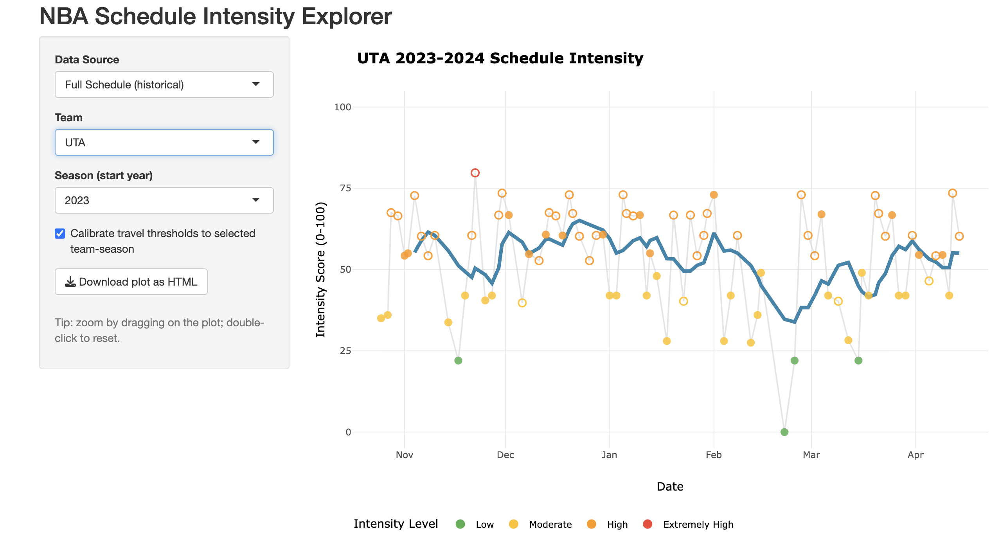

# NBA Schedule Intensity & Recovery Stress Modeling

**Project Description:**  
This project analyzes NBA schedule structure to quantify how game density, travel demands, and recovery windows interact to create cumulative workload stress over the course of a season. The goal was to develop a transparent, team-agnostic framework that can be applied across the league.

An interactive R Shiny application was built to allow users to explore schedule-intensity patterns for any NBA team across the season.

**[➡️ Launch Interactive R Shiny App]([https://annabusatto.shinyapps.io/nba-schedule-intensity](https://annabusatto.shinyapps.io/nba_schedule_intensity/)**  

---

## 1. Data Description

- **NBA Game Schedule Data**  
  Publicly available schedule data, including game dates, tip-off times, home/away designation, and days of rest between games.

- **Travel Context**  
  Away games and clustered road trips were incorporated to reflect travel-related recovery constraints.

---

## 2. Feature Engineering & Modeling

### 2.1 Schedule Intensity Index

A composite **Schedule Intensity Score** was calculated using:

- Days of rest between games  
- Back-to-back and short-turnaround indicators  
- Road games and travel clustering  
- Rolling cumulative game density  

All components were standardized to allow comparison across teams and time.

### 2.2 Rolling Stress Accumulation

- Rolling schedule intensity metrics were computed to capture compounding effects across consecutive games.
- High-intensity stretches were identified where limited recovery persisted over time.

---

## 3. Exploratory Analysis

- Examined how schedule-driven stress accumulates differently across teams.
- Identified periods where schedule intensity increased rapidly despite similar total game counts.
- Compared home-heavy and travel-heavy stretches within team schedules.

---

## 4. R Shiny Application

The R Shiny app allows users to:

- Select any NBA team  
- Visualize schedule intensity across the season timeline  
- Identify compressed and travel-heavy stretches  
- Explore how alternative weighting assumptions affect schedule stress profiles  

*Figure 1: Overview of the NBA schedule intensity R Shiny application.*

---

## 5. Key Takeaways

- Schedule structure alone can create meaningful variation in recovery stress
- Compressed and travel-heavy stretches produce compounding load even without tracking data
- League-wide schedule data can be transformed into scalable decision-support tools

---

*Tools used: R (tidyverse, lubridate, ggplot2, shiny), Excel*
